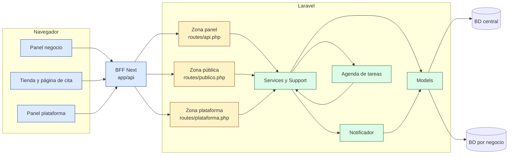
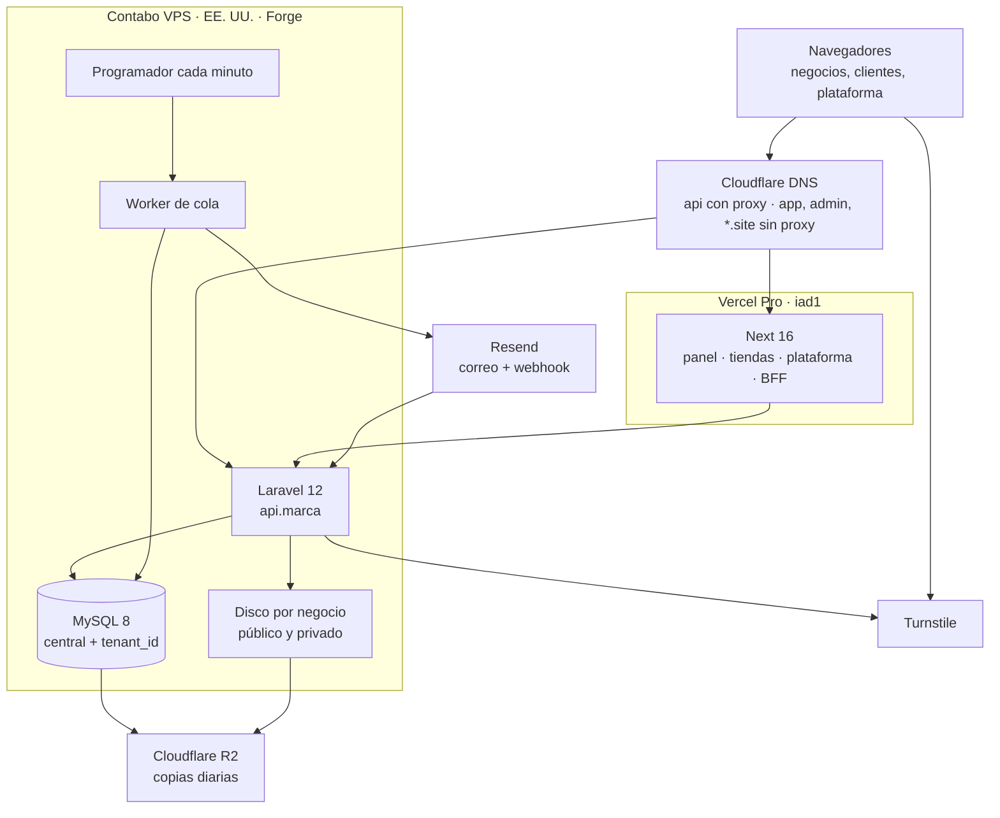
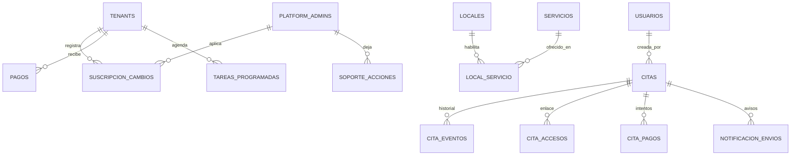

# Architecture Spine — ChiraFlow

## Design Paradigm

**Monolito modular por capas, uno por repositorio, con aislamiento físico por
inquilino (una base de datos por negocio) y un BFF delante del navegador.**

| Lado | Capas (de fuera hacia dentro) | Dónde |
| --- | --- | --- |
| Backend | Ruta de su zona → middleware de zona → `FormRequest` → `Controller` → **`Service`** → `Model` · salida por `Resource` | `Backend-Sass/routes/{zona}.php`, `app/Http/{Controllers,Requests,Resources}`, `app/Services`, `app/Support`, `app/Models` |
| Frontend | `app/(zona)/…/page.tsx` (solo composición) → `features/<modulo>/components` → `hooks` (React Query) → `services` → `lib/api/client.ts` → BFF `app/api/[...path]` | `Sass-ChiraFlow/web/src` |

Las **reglas de negocio y de seguridad viven solo en `Service` y `Support`**.
Controladores, Requests, componentes y hooks las llaman; nunca las copian.

## Invariants & Rules

Dependencias solo en la dirección de las flechas: ninguna zona llama a otra
zona, ningún `Model` llama a un `Service`, y el navegador nunca llama a
Laravel directamente.

### AD-1 — Aislamiento por base de datos de cada negocio [ADOPTED]

- **Binds:** all · NFR-1
- **Prevents:** que un negocio lea o escriba datos de otro, o que la cabecera del cliente elija el negocio.
- **Rule:** cada negocio tiene su base `tenant_{id}` (id inmutable, nunca el slug). En la zona panel el negocio **sale del token**; `X-Tenant` solo es una pista y, si no coincide, 404. En la zona pública sale del **slug** o del **token de la cita** (AD-11). Pedir un recurso de otro negocio responde **404**, nunca 403. Tablas centrales con `tenant_id` se filtran siempre por el negocio resuelto, nunca por un id recibido. Cada endpoint de recursos tiene su test de aislamiento.

### AD-2 — Una regla, un sitio [ADOPTED]

- **Binds:** all · NFR-12
- **Prevents:** reglas duplicadas que divergen (tres incidentes en septiembre de 2026).
- **Rule:** toda regla de negocio o de seguridad vive en **un** `Service` o clase de `app/Support` y la llaman todos los caminos (panel, tienda, enlace del cliente, plataforma, tareas). El controlador puede ser un punto de llamada adicional (p. ej. el `authorize()` de un Request para cortar antes de validar), nunca una segunda copia.

### AD-3 — Una app por lado, una zona por superficie

- **Binds:** zonas panel, pública, plataforma, archivos · FR-36..FR-43, FR-60, FR-69
- **Prevents:** que un token, un middleware o una ruta de una superficie abra otra.
- **Rule:** Laravel: `routes/api.php` (panel), `routes/publico.php` (tienda y cita del cliente, sin sesión), `routes/plataforma.php` (plataforma) y `archivos`. Cada zona tiene **su** grupo de middleware y **su** forma de identificarse: token Sanctum de `users` (panel), ninguna + slug o token de cita (pública), token Sanctum de `platform_admins` con capacidad `plataforma` y 2FA (plataforma). Next: grupos `(dashboard)`, `(publico)` y `(plataforma)` servidos en su subdominio (AD-15). Un test por zona comprueba que la credencial de otra zona recibe 401/404.

### AD-4 — Orden único de autorización

- **Binds:** zona panel · FR-14, FR-62..FR-66, NFR-11
- **Prevents:** endpoints que comprueban en distinto orden o se saltan un paso, y escrituras que no respetan el alcance que sí respetan las lecturas.
- **Rule:** toda petición del panel pasa, en este orden: **(1) aislamiento** → 404; **(2) suscripción** vigente → 403 `suscripcion_vencida` (salvo Mi Plan, perfil, soporte y salir); **(3) plan** incluye la función (AD-5) → 403 `plan_no_incluye`; **(4) permiso** del rol, `puede:modulo,nivel` → 403 `sin_permiso`; **(5) alcance** por sede y `solo_propios` → 404. Los **límites** de capacidad se comprueban solo al crear o activar → 422. El alcance se aplica **igual en lecturas y en escrituras** (crear, editar, reasignar). Asignar un rol o un alcance exige que sea **subconjunto** del de quien lo asigna (FR-63). Solo se pregunta por capacidades, nunca por la clave del rol, salvo el rango del administrador general en `App\Support\Rango`.

### AD-5 — Funciones del plan como capacidad del negocio

- **Binds:** planes, Mi Plan, menú · FR-55..FR-58, FR-76
- **Prevents:** comprobar el nombre del plan en el código, o dos listas de funciones divergentes.
- **Rule:** catálogo único de claves de función en el código (junto a `RolesSistema::MODULOS`); los valores por plan (booleano o número) viven en `planes.features` (JSON) y los límites numéricos en sus columnas. Una sola comprobación (paso 3 de AD-4). `GET /capacidades` devuelve permisos, alcance **y** funciones del plan, y el frontend arma el menú solo con eso. El plan nunca concede permisos a una persona.

### AD-6 — Disponibilidad y reservabilidad en un solo cálculo [ADOPTED + A-7]

- **Binds:** citas, tienda, enlace del cliente, opciones para agendar · FR-21, FR-27, FR-38, FR-62, FR-67, FR-69
- **Prevents:** que el panel, la tienda o el enlace ofrezcan huecos o combinaciones distintas.
- **Rule:** `App\Services\Disponibilidad` calcula huecos y un único service de reservabilidad decide si servicio + profesional + sede es reservable (FR-67). Todo camino que ofrezca o valide una hora los usa. La copia de `web/src/features/calendario/disponibilidad.ts` es deliberada y se verifica con el **caso dorado compartido** (AD-19); cambiar una copia sin la otra rompe ese test.

### AD-7 — Toda ocupación o liberación de un hueco pasa por el mismo camino con bloqueo [ADOPTED]

- **Binds:** crear, editar, reprogramar, cancelar, reserva pública, caducidad del pago · FR-28, FR-39, FR-69, FR-71
- **Prevents:** solapes o carreras entre una reserva y una caducidad o una reprogramación simultáneas.
- **Rule:** cualquier escritura que ocupe o libere tiempo de un profesional se hace en el service de citas, en una transacción con `SELECT … FOR UPDATE` sobre las citas de ese profesional en la ventana afectada, revalidando disponibilidad y reservabilidad dentro del bloqueo. Nadie escribe `citas.starts_at`, `ends_at`, `estado` o `profesional_id` fuera de ese service. `estado_pago` y `cita_pagos` los escribe solo el service de pagos; cuando un pago cambia el estado de la cita (verificar → `confirmada`, caducar → `cancelada`), el service de pagos **llama** al de citas, nunca escribe `citas.estado` por su cuenta.

### AD-8 — Historial de dominio y un único notificador

- **Binds:** citas, pagos, equipo, suscripción, cuenta · FR-68, FR-73..FR-76
- **Prevents:** correos de operaciones que se deshicieron, avisos duplicados y reglas de aviso repartidas por los services.
- **Rule:** los services **solo registran** lo que pasó como evento tipado **dentro de su transacción**, en **una sola tabla de eventos por base**: `eventos_dominio` en cada base de negocio (citas, pagos, equipo) y en la base central (suscripción, cuenta, plataforma), con tipo, entidad, id, actor (`usuario | cliente | plataforma | sistema` + id), datos y versión de la entidad. El historial de una cita (FR-68) es la consulta de sus eventos. Un único `Notificador` traduce cada tipo de evento en envíos según la matriz de la propuesta §4.3, crea filas en `notificacion_envios` **en la misma base que el evento**, con clave de idempotencia **evento + entidad + destinatario + versión**, y los encola **después del commit**. El trabajo de envío relee el estado y omite lo que ya no aplica. Los estados (`aceptado` ≠ `entregado`, rebote, queja) llegan por el webhook firmado de Resend y se resuelven por un índice central id del proveedor → negocio. Ningún service llama a `Mail` ni a `Notification` directamente, salvo los correos de cuenta, que pasan al mismo mecanismo al migrarse.

### AD-9 — Agenda central de tareas con hora

- **Binds:** recordatorios, caducidad de pagos, aviso de pago sin revisar, agenda del día · FR-71, FR-73, FR-74
- **Prevents:** recorrer todas las bases cada minuto, o trabajos diferidos imposibles de cancelar.
- **Rule:** las tareas con hora se guardan en la tabla central `tareas_programadas` (negocio, tipo, referencia, `ejecutar_en` en UTC, estado), **sin datos personales**. Un comando por minuto encola un trabajo por tarea vencida; el trabajo inicializa el negocio y **vuelve a comprobar** que la tarea sigue aplicando (versión de la cita) antes de actuar. Como la agenda es central y los eventos viven en la base del negocio, **no hay transacción común**: las tareas se crean o cancelan **después del commit**, desde un trabajo encolado con reintentos, y **nadie confía en que una tarea vieja esté cancelada**: la re-comprobación por versión es la que manda. El ciclo de vida diario (vencer, avisar, suspender) recorre la tabla central `tenants` y no usa esta agenda.

### AD-10 — Un único camino para cambiar la suscripción

- **Binds:** plataforma, ciclo de vida, futura pasarela · FR-55..FR-60
- **Prevents:** que el panel manual, el ciclo de vida o la pasarela apliquen reglas distintas o se pisen.
- **Rule:** todo cambio de plan, periodicidad, vigencia, complementos o estado pasa por `SuscripcionService::aplicar(cambio)`, que escribe `tenants` y una fila **solo de inserción** en `suscripcion_cambios` (origen `manual | pasarela | sistema`, actor, motivo, plan anterior y nuevo, periodicidad, vigencia, complementos, `pago_id` opcional) en la misma transacción. **Activar nunca crea un pago como pagado**: los pagos se registran aparte en `pagos` (estado por defecto `pendiente`). Cada negocio tiene `modo_cobro` (`manual | pasarela`); los eventos externos son idempotentes por id de evento y llevan la versión de la suscripción que conocían: una versión vieja se rechaza.

### AD-11 — Superficie pública sin sesión

- **Binds:** zona pública · FR-36..FR-45, FR-69, FR-70
- **Prevents:** exposición de datos internos, enumeración de citas y abuso automatizado.
- **Rule:** la tienda resuelve el negocio por **slug** (404 si no existe, no fijó nombre, desactivó la tienda o está suspendido), y aplica el estado de la suscripción y las funciones del plan con **el mismo comprobador** que el panel (AD-5), p. ej. una sede por encima del límite tras la gracia deja de aceptar reservas; la página del cliente, por un **token de cita** aleatorio del que solo se guarda el hash (`cita_accesos`), que identifica negocio y cita, caduca 7 días después de la cita y es revocable. **Ningún id numérico en URLs públicas.** Los GET no cambian nada: toda acción se confirma con un POST. Los Resources públicos son propios y nunca exponen costes, comisiones, correos del equipo ni estados internos. Cada ruta pública tiene un límite de peticiones **con nombre**, y los formularios de login, registro, recuperación, reserva y subida de comprobante exigen **Cloudflare Turnstile**, verificado en Laravel antes de procesar. La subida de comprobantes cumple la regla 7 del backend (autorización por `codigo`, tipo real, re-codificado, UUID, disco privado, enlace firmado, límites por IP y por código).

### AD-12 — Panel de plataforma separado y sin acceso a los negocios

- **Binds:** zona plataforma · FR-60
- **Prevents:** que una cuenta de negocio entre a la plataforma, o que la plataforma lea datos internos de un negocio sin rastro.
- **Rule:** solo `platform_admins`, con 2FA obligatorio; roles `superadmin` (cambia planes, registra pagos, suspende) y `soporte` (consulta). La zona plataforma **no inicializa tenancy**: solo lee y escribe la base central. Toda acción escribe en `soporte_acciones`. El acceso a datos de un negocio queda fuera hasta que exista un permiso temporal, motivado y registrado (Deferred).

### AD-13 — El contrato de la API cambia primero

- **Binds:** todas las historias que tocan la API · NFR-6
- **Prevents:** backend y frontend implementando formas distintas del mismo endpoint.
- **Rule:** `Sass-ChiraFlow/docs/api-contract.md` es el único contrato y se edita desde el repo del frontend. Una historia que cambia la API **empieza editando el contrato**, después implementa el backend y después conecta el frontend; la historia solo se cierra con las tres partes. `pendientes-contrato.md` queda cerrado. Envoltorios `{data}` y `{data, meta}`, `search`, filtros como query params, 422 con `errors` por campo, 403 con `codigo`.

### AD-14 — Las migraciones solo se añaden [ADOPTED + 2026-09-19]

- **Binds:** `database/migrations` y `database/migrations/tenant`
- **Prevents:** bases de negocio con esquemas distintos, o migraciones que chocan en los negocios existentes (incidente del 2026-09-04).
- **Rule:** nunca se edita ni se renombra una migración que ya corrió; cada cambio es un archivo nuevo. Las de tenant se despliegan con `tenants:migrar-provisionados`, nunca con `tenants:migrate` a secas. Toda migración de datos (p. ej. `admin → panel`, `local_servicio` completo) se incluye en la misma migración que el cambio de esquema.

### AD-15 — Dominios y sesión

- **Binds:** DNS, BFF, cookies · FR-36, FR-60, FR-69
- **Prevents:** que la sesión del panel viaje a una tienda, o que una tienda lance acciones del panel.
- **Rule:** `app.<marca>` panel, `admin.<marca>` plataforma, `api.<marca>` Laravel, `{slug}.site.<marca>` tienda y página de cita (sin sufijo de país). Las cookies de sesión son **solo del host** y llevan el prefijo `__Host-`; el panel y la plataforma usan cookies distintas. **El BFF decide por el host** qué cookie lee y a qué zona reenvía: desde `app.` solo a la zona panel y la pública; desde `admin.` solo a la zona plataforma; desde `*.site.` solo a la pública y sin credencial. El BFF rechaza toda petición que cambie datos si su `Origin` no es su propio host. Las tiendas **no aceptan HTML ni scripts** del negocio: solo datos. Subdominios reservados: `www`, `api`, `admin`, `app`, `mail`, `ftp`, `site` y los del remitente.

### AD-16 — Tiempo y dinero

- **Binds:** all · NFR-3, NFR-6
- **Prevents:** recordatorios a destiempo y totales que no cuadran.
- **Rule:** en base de datos, `DATETIME` en la zona del negocio para citas (como hoy) y **UTC** para todo lo programado (`tareas_programadas.ejecutar_en`, `notificacion_envios.programado_para`); la conversión la hace solo `Jornada`/`Disponibilidad` y el servicio de tareas. Importes en soles como `DECIMAL(10,2)`, y en la API como número plano. Precio y duración de una línea de cita se congelan al reservar.

### AD-17 — Nada ficticio en producción

- **Binds:** frontend · FR-51, PRD §8
- **Prevents:** pantallas con datos inventados al lanzar, o un menú que ofrece lo que el backend niega.
- **Rule:** en producción `NEXT_PUBLIC_USE_MOCKS=false` y sin lista de módulos conectados. Un módulo sin backend **no aparece** en el menú ni en las rutas. El menú y los botones salen solo de `GET /capacidades` (permisos, alcance y funciones del plan), y esconder una opción nunca sustituye al 403 del backend.

### AD-18 — Un solo tablero de seguimiento

- **Binds:** proceso de las dos sesiones
- **Prevents:** dos tableros divergiendo, o dos sesiones escribiendo el mismo repositorio.
- **Rule:** `sprint-status.yaml` en `Sass-ChiraFlow/_bmad-output/implementation-artifacts/` sustituye a `estado.md`; cada sesión cambia solo el estado de sus propias tareas; el git de la carpeta de planificación lo hace el repo del frontend; cada sesión hace git solo en su repo, en una rama `sprint-N/…` por historia, merge con `--no-ff`.

### AD-19 — Pruebas que protegen las fronteras

- **Binds:** ambos repos
- **Prevents:** divergencia silenciosa entre las dos copias del motor de huecos, y roturas que solo se ven con los dos repos juntos.
- **Rule:** backend: Pest por historia, con test de aislamiento y de autorización (AD-4) por endpoint. Frontend: Vitest para la lógica (motor de huecos, adaptadores). **Caso dorado compartido** en `Sass-ChiraFlow/docs/fixtures/` (entradas + huecos esperados en JSON), leído por Vitest y por Pest; el backend guarda una copia y un test comprueba que es idéntica cuando el repo del frontend está presente. Playwright cubre 4–5 recorridos completos contra el sistema real antes de lanzar: registro y onboarding, reserva con pago QR, gestión por enlace, activación de plan en la plataforma y la agenda del panel.

### AD-20 — Entornos y operación

- **Binds:** despliegue · NFR-9
- **Prevents:** entornos que comparten datos o remitentes, o un servidor sin copias recuperables.
- **Rule:** tres entornos (local, pruebas y producción) con **bases, usuario MySQL, remitente de correo y dominios propios**; nunca datos reales en pruebas. En cada entorno de servidor: worker de cola siempre activo y programador **cada minuto** (AD-9 lo exige). MySQL con permiso para crear bases solo para el usuario que provisiona. Copia diaria de la base central **y de cada negocio**, más los archivos de cada negocio, fuera del servidor (Cloudflare R2), con una **restauración de prueba mensual**. Los secretos solo en variables de entorno del proveedor. **MySQL 8.4 LTS** en pruebas y producción, y la misma versión en local (hoy Laragon trae 8.0.30, sin soporte desde abril de 2026); PostgreSQL descartado. **Sin contenedores en producción**: Forge instala el stack nativo en el VPS. Operación mínima: monitor externo de disponibilidad de `api.` y `app.`, alertas de la plataforma X-1/X-2 (rebotes, trabajos fallidos, cola atascada) y logs rotados 14 días.

### AD-21 — Provisioning perezoso y procesos diarios [ADOPTED]

- **Binds:** registro, ciclo de vida, métricas · FR-2, FR-58, FR-59
- **Prevents:** paneles sin base de datos y consultas cruzadas entre negocios.
- **Rule:** la base de un negocio la crea un job **al verificar el correo**; antes, toda ruta con tenancy responde 503. El **ciclo de vida** es un comando diario sobre la tabla central `tenants` y todo cambio de estado pasa por `SuscripcionService` (AD-10). Las **métricas nocturnas** son un comando diario que entra en cada negocio activo una vez y escribe agregados en `tenant_metricas_diarias`; es la única excepción permitida a «no recorrer todas las bases» (AD-9), por ser diaria. Nunca hay JOIN entre bases.

## Consistency Conventions

| Concern | Convention |
| --- | --- |
| Nombres | Dominio en español y en singular para modelos (`Cita`, `Profesional`); tablas en plural; rutas REST en plural y kebab-case (`categorias-servicios`); códigos de error en `snake_case` (`sin_permiso`, `plan_no_incluye`, `suscripcion_vencida`) |
| Ids | Numéricos internos en el panel; **nunca** en URLs públicas (slug, `codigo`, token). El id público de un profesional es `profesionales.id` en toda la API |
| Enums | El backend emite la clave; etiquetas y colores los pone el frontend. Un valor nuevo de enum exige contrato + migración nueva |
| Fechas y horas | API: `YYYY-MM-DD`, `HH:MM` (24 h), timestamps ISO 8601; días ISO 1 = lunes |
| Respuestas | `{data}` · `{data, meta}` paginado (tope `per_page` 200) · 422 `{message, errors}` · 403 `{message, codigo}` · 404 sin cuerpo significativo |
| Mutación de estado | Solo por el service dueño de la entidad (AD-7, AD-10); cada cambio relevante deja evento en `eventos_dominio` (AD-8). El stock solo cambia con movimientos de inventario, nunca escribiendo `productos.stock` |
| Actor | Todo evento y registro de auditoría guarda quién: `usuario` (cuenta del negocio), `cliente` (por su enlace), `plataforma` (administrador) o `sistema` (tareas y ciclo de vida) |
| Configuración del negocio | Columnas o JSON `configuracion` de `tenants` (central); la leen tienda y panel por su Resource; `PUT` parcial por sección |
| Archivos | Disco `public` por negocio para imágenes de catálogo servidas por `/archivos/{tenant}/{ruta}`; disco **privado** por negocio para comprobantes, servidos solo por enlace firmado |
| Idioma | Todo texto visible y todo 422 en español (`lang/es`); los correos con versión de texto |
| Correo | Remitente del subdominio de correo del producto con el nombre del negocio; respuesta al correo del negocio o de la sede |
| Frontend | `features/<modulo>/{components,hooks,services,types}`; CRUD con `crearRecurso` + `crearHooksRecurso`; colores del tema, nunca hexadecimales; diálogos con `dialogoResponsive` (hoja inferior en móvil) |
| Ramas y commits | Una rama por historia `sprint-N/<historia>`; mensajes en español; merge `--no-ff` con tests en verde |

## Stack

| Name | Version |
| --- | --- |
| PHP | 8.3 (Laragon en local) |
| Laravel | 12.66 |
| stancl/tenancy | 3.9 (3.10.1 disponible, compatible) |
| Laravel Sanctum | 4.3 |
| Pest | 3.8 |
| resend/resend-laravel | 1.4 |
| MySQL | 8.4 LTS (local hoy 8.0.30, a igualar) |
| Next.js | 16.3 |
| React | 19.2 |
| MUI | 7.3 |
| TanStack Query | 5.101 |
| Vitest | 5.0 |
| Playwright | 1.63 |
| Cloudflare Turnstile | servicio gestionado |
| Hosting backend | Contabo Cloud VPS 6 (6 vCPU, 12 GB, 200 GB), región EE. UU., con Laravel Forge |
| Hosting frontend | Vercel Pro, funciones en `iad1` |
| Correo | Resend Pro |
| DNS y copias | Cloudflare (DNS gratuito, R2) |

## Structural Seed

### Despliegue y entornos

Pruebas: segundo sitio en el mismo VPS (base, usuario MySQL y remitente
propios) + vistas previas de Vercel. Local: Laragon + `next dev`.

### Entidades nuevas y su relación con las existentes

Central: `tenants`, `pagos`, `suscripcion_cambios`, `platform_admins`,
`soporte_acciones`, `tareas_programadas`, índice de envíos por id del
proveedor. Por negocio: todo lo demás. El detalle de columnas lo fijan las
migraciones de cada historia.

## Capability → Architecture Map

| Capability / Area | Lives in | Governed by |
| --- | --- | --- |
| FR-1..FR-9 alta, acceso, onboarding | Zona panel + auth pública, `OnboardingService` | AD-1, AD-3, AD-11 (Turnstile), AD-8 |
| FR-10..FR-14, FR-62..FR-66 equipo y permisos | `UsuarioService`, `ProfesionalService`, `Capacidades`, `Rango` | AD-2, AD-4 |
| FR-15..FR-26 catálogo, clientes, sedes, configuración, inventario | Services de cada módulo | AD-2, AD-4, AD-14 |
| FR-21, FR-27, FR-67 servicios por sede, huecos, reservabilidad | `Disponibilidad` + service de reservabilidad | AD-6, AD-19 |
| FR-28..FR-35, FR-68 citas, calendario, historial | `CitaService`, `cita_eventos` | AD-4, AD-6, AD-7, AD-8 |
| FR-36..FR-43 tienda | Zona pública, Resources públicos | AD-3, AD-11, AD-15 |
| FR-44..FR-46, FR-71, FR-72 pago QR | Service de pagos, disco privado | AD-7, AD-9, AD-11 |
| FR-69, FR-70 gestión por enlace | Zona pública, `cita_accesos` | AD-7, AD-11 |
| FR-73..FR-76 notificaciones | `Notificador`, `notificacion_envios`, webhook | AD-8, AD-9, AD-16 |
| FR-55..FR-58 suscripción y ciclo de vida | `SuscripcionService`, comando diario | AD-5, AD-10 |
| FR-60 panel de plataforma | Zona plataforma, `(plataforma)` en Next | AD-3, AD-10, AD-12 |
| FR-61, NFR-10 landing y legales | `(publico)` en Next | AD-15 |
| FR-2, FR-58, FR-59 provisioning, ciclo de vida, métricas | Job de provisioning, comandos diarios | AD-10, AD-21 |
| FR-47..FR-54 WhatsApp, caja, dashboard, reportes, soporte (posteriores salvo dashboard mínimo) | Services de cada módulo | AD-4 (alcance por sede), AD-8, AD-17 |
| NFR-9 operación | Forge, Vercel, Cloudflare, R2 | AD-20 |

## Deferred

| Qué | Por qué puede esperar | Revisar cuando |
| --- | --- | --- |
| **Actualizar a Laravel 13** | Decisión del usuario: quedarse en 12 por ahora | **Antes del 2027-02-24**, fin de los parches de seguridad de Laravel 12 |
| Pasarela de suscripciones (Mercado Pago) | Lanzamiento con activación manual; AD-10 ya deja el hueco | Tras el lanzamiento |
| Varios negocios por persona | Hoy `users.tenant_id` es único y el email global; cambiarlo toca login y tokens | Cuando un cliente real lo pida |
| Dominio propio por negocio | Se sirve igual por Vercel; AD-15 ya separa sesión y tiendas | Plan que lo incluya |
| Acceso temporal de soporte a un negocio | Requiere permiso motivado, visible y auditado | Con el módulo Soporte |
| WhatsApp, SMS, campañas | Fuera del lanzamiento; el `Notificador` admite canales nuevos | Tras el lanzamiento |
| Caja, Reportes, Soporte con tickets | Fuera del lanzamiento; heredan AD-4 (alcance por sede) | Tras el lanzamiento |
| Base de datos en servidor propio o gestionada; archivos en R2/S3 | El volumen inicial cabe en un VPS | Rendimiento sostenido bajo o disco > 60 % |
| SEO de la tienda (Server Components con metadatos) | No bloquea reservas | Si el piloto lo pide |
| Servicio de rastreo de errores (p. ej. Sentry) | Logs rotados y alertas X-1/X-2 bastan para el piloto | Antes de abrir el registro al público |
| Retención y borrado de comprobantes y datos de clientes | La purga del negocio ya borra su base; falta una política por dato | Con los textos legales (L-5) |
