# Flujos del SaaS

Diagramas de cómo funciona el sistema, sacados de leer el Laravel
(`SAAS_LINEA_BIEN`, rama `feat/planes-suscripcion`).

## Cómo pasarlos a Excalidraw

1. Abre [excalidraw.com](https://excalidraw.com)
2. Menú (☰) → **Mermaid to Excalidraw**
3. Copia **un** bloque de código de este archivo y pégalo ahí
4. **Insert** — quedan como formas editables, no como imagen

> Van de uno en uno: el conversor toma un diagrama por vez. Excalidraw solo
> entiende `flowchart`, así que todos están escritos así (nada de diagramas
> de clases ni ER, que no importaría).

Lo que aparece marcado con ⚠️ o en los nodos `FALTA` **no existe en el código**:
es un hueco detectado, no algo que haya que dibujar como si funcionara. Cómo
se resuelve cada uno está en [api-contract.md](api-contract.md) y en la ficha
de la vista correspondiente.

---

## 1. Las tres caras del producto

Lo primero que conviene entender: no es una aplicación, son tres, sobre la
misma base de datos.

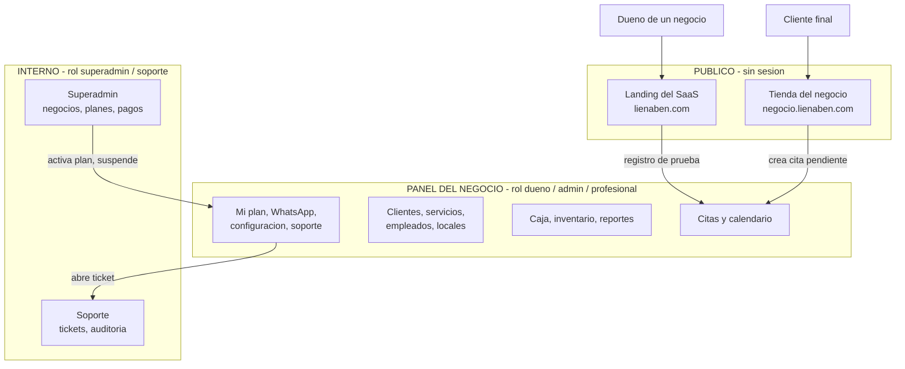

**Clave:** el cliente final **nunca** entra al panel, y el dueño **nunca**
gestiona su tienda desde otro sitio que no sea el panel. La tienda es un
reflejo de lo que se configura dentro.

---

## 2. Alta de un negocio

Un solo formulario crea cuatro cosas. Es el momento en que nace el inquilino.

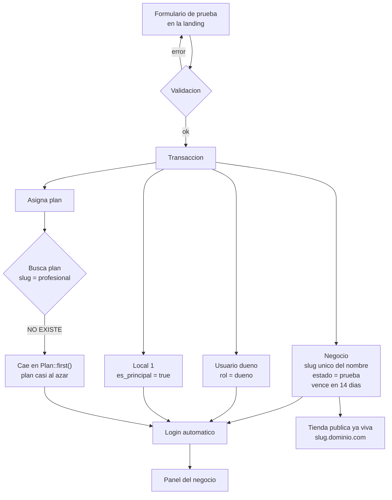

⚠️ El nodo del plan es un **bug real**: los slugs son `basico`, `premium` y
`pro`. Nunca encuentra `profesional`, así que todo negocio nuevo recibe el
primero por id.

---

## 3. Reserva desde la tienda pública

El flujo que da de comer al producto.

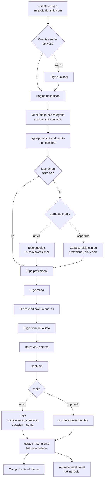

**El punto crítico es "el backend calcula huecos".** Solo se ofrecen horas en
las que la cita cabe de verdad; el cliente no puede elegir una hora imposible.

---

## 4. Cómo se calculan los huecos

El corazón del producto. Este es el árbol de decisión real de
`generarHorarios`.

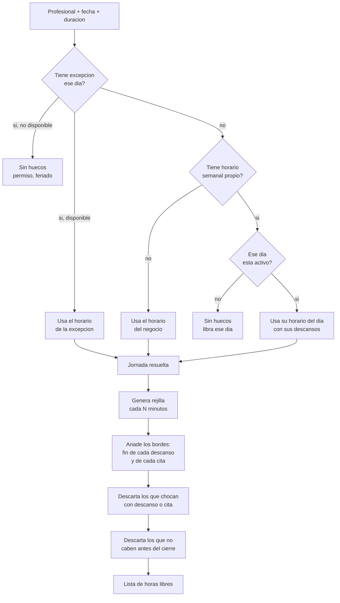

Los **bordes** del paso 3 importan: sin ellos, un servicio de 50 minutos
sobre una rejilla de 30 dejaría huecos muertos. Una cita que termina a las
09:50 debe ofrecer las 09:50, no esperar a las 10:00.

---

## 5. El mismo hueco, dos puertas distintas

Esto explica el problema del punto 5.3 de la lectura.

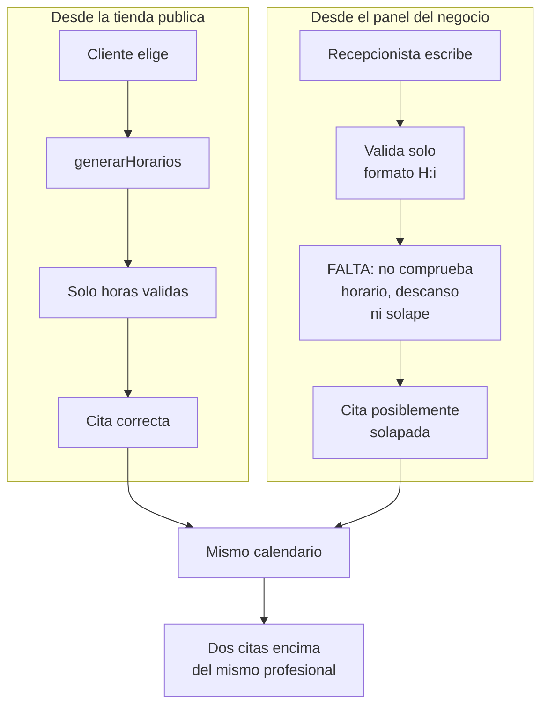

⚠️ El motor existe una sola vez y vive dentro del controlador público. El
panel no lo usa.

---

## 6. Ciclo de vida de la suscripción

Aquí está el agujero más grande del producto.

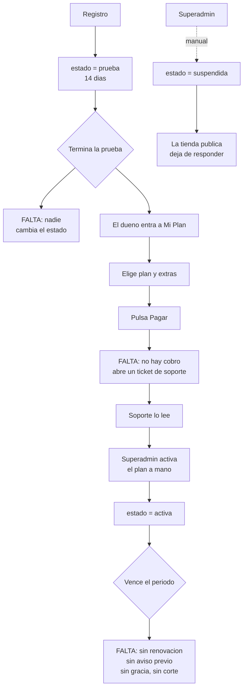

Todo lo que dice `FALTA` funciona hoy porque **alguien lo hace a mano**. Con
5 clientes se sostiene; con 30 no.

---

## 7. Qué límites impone el plan

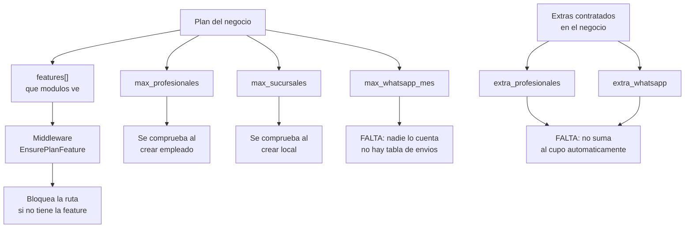

⚠️ Se cobra un cupo de WhatsApp que nadie mide, y los extras que se pagan no
suben ningún límite solos.

---

## 8. La caja del día

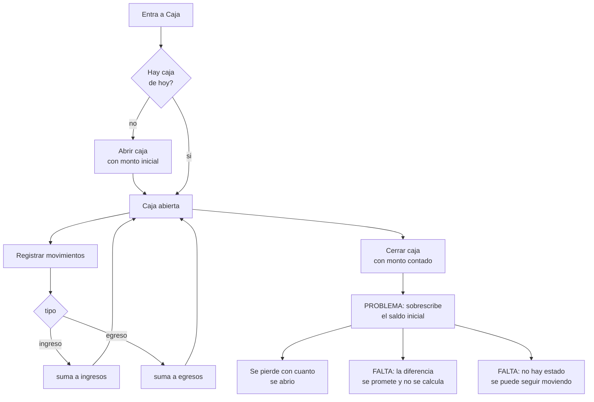

⚠️ Los tres problemas se arreglan con dos columnas: `monto_inicial` y
`monto_final` (nullable = abierta).

---

## 9. Mensajes de WhatsApp

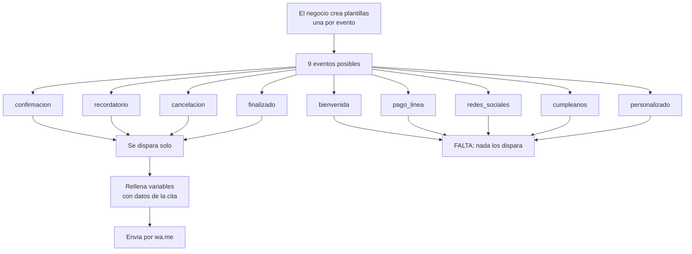

⚠️ Cuatro de nueve eventos funcionan. Los otros cinco se pueden configurar
pero no los llama nadie.

---

## 10. Quién ve qué

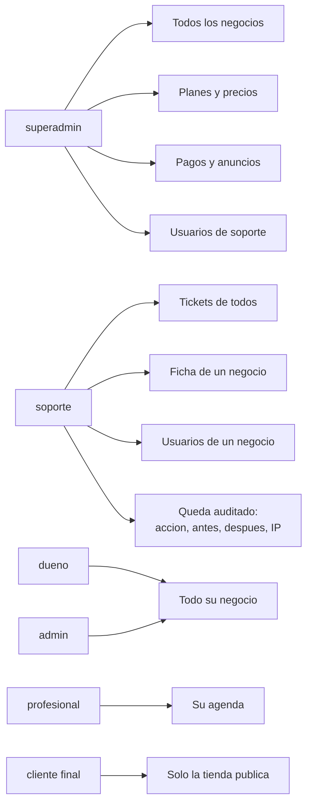

La fila de auditoría es de lo mejor del proyecto: cada acción de soporte
guarda qué tocó, cómo estaba antes, cómo quedó y desde qué IP.

---

## 11. Cómo se relacionan los datos

Estructura, no ER formal (Excalidraw no dibuja diagramas ER).

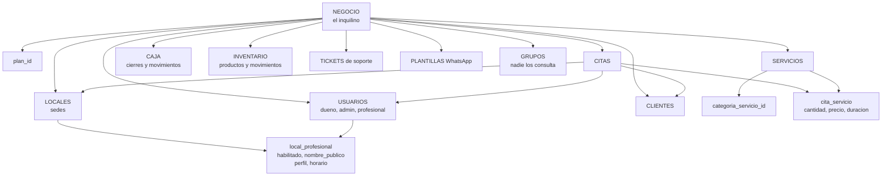

Dos cosas que se ven mejor dibujadas que leyendo:

- **`cita_servicio` es la clave del multi-servicio**, y solo la usa la tienda
  pública. El panel trabaja con un servicio por cita.
- **`local_profesional` es donde vive la identidad pública** del profesional:
  con qué nombre aparece y su biografía, distinto en cada sede.

---

## 12. Lo que hay que decidir

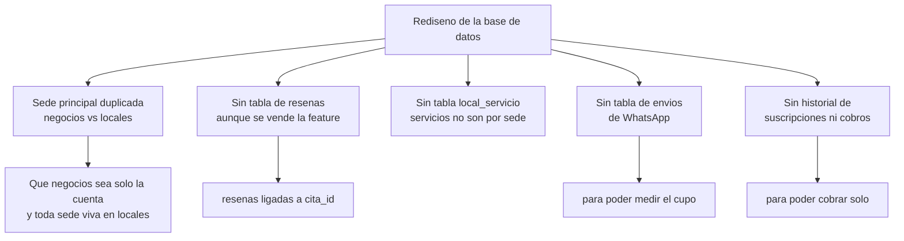

El detalle de cada punto, con los esquemas ya decididos, está en
[plan-backend.md](plan-backend.md) y en
[vistas/tienda-publica.md](vistas/tienda-publica.md).
