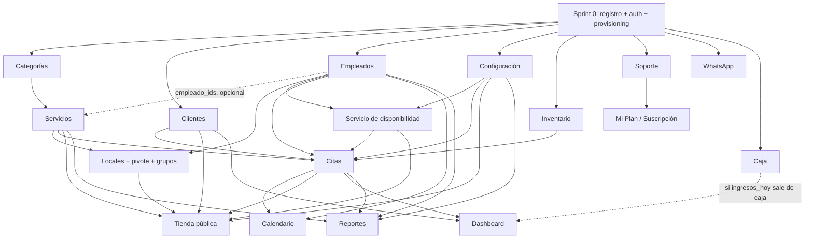

# Plan de sprints — construir `backend-sass` y conectar la maqueta

Fecha: 2026-08-14. Fuentes: [`api-contract.md`](api-contract.md), las 17 fichas
de [`vistas/`](vistas/), [`plan-backend.md`](plan-backend.md), y
`F:\PERSONAL_JEAN\backend-sass\docs\discrepancias.md` (**CONGELADO** — sus
decisiones prevalecen sobre los SQL de referencia; aquí se cita por §).

**Contexto de ejecución.** Una sola persona, dos repos, sesiones de Claude
Code alternadas: el backend implementa un módulo → el frontend lo conecta →
módulo cerrado. Por eso cada ficha separa tareas de BACKEND y de FRONTEND, en
el orden en que se ejecutan. No hay estimación de horas: el orden lo dictan
las dependencias, y se marca qué puede ir en paralelo (útil para elegir qué
módulo abrir si el otro está bloqueado por una decisión).

**Este documento no lleva el progreso.** Qué está hecho y quién lo tiene en la
mano ahora mismo está en [`estado.md`](estado.md), el tablero que comparten las
dos sesiones.

**Alcance fijado**: auth solo con email + contraseña (nada de OAuth). Los
clientes finales **no tienen cuenta** (§2.2): reservan sin login y gestionan
su cita por el `codigo` enviado por WhatsApp.

---

## 1. Grafo de dependencias entre módulos

Cada arista sale de una dependencia **real del contrato** (un campo del
payload, un select que carga datos de otro recurso, o un flujo de pantalla),
no de intuición. La evidencia, debajo del grafo.



### Evidencia de cada arista

| Arista | Dónde lo dice el contrato |
|---|---|
| Categorías → Servicios | payload de servicio lleva `categoria_id`; la entidad devuelve `categoria: {id,nombre}` (§3 Servicio). El formulario pide `GET /categorias-servicios` para su select (flujo Citas/Servicios) |
| Empleados → Servicios *(parcial)* | payload lleva `empleado_ids[]`; la entidad devuelve `empleados: {id,nombre}[]` vía `servicio_profesional`. Es **opcional en el payload**, por eso Servicios puede salir antes que Empleados con `empleados: []` |
| Empleados → Locales | `GET /locales/{id}/profesionales` devuelve *una fila por cada profesional del negocio* — sin profesionales no hay pestaña 2. `grupo_profesional` referencia profesionales |
| Servicios → Locales | la pestaña Servicios reutiliza `GET /servicios`; `grupo_servicio` referencia servicios |
| Empleados + Configuración → Disponibilidad | la precedencia de jornada (contrato §4) lee `horario[]` y `excepciones[]` del profesional, y como respaldo `configuracion.horario_apertura/cierre`; el paso de la rejilla sale de `configuracion.agenda` |
| Disponibilidad → Citas | la ficha de citas exige revalidar `hora_inicio` en el backend (422 bajo el selector); el selector de huecos del panel consume `GET /citas?fecha=…` + `GET /configuracion` |
| Servicios → Citas | payload `servicio_id`; `hora_fin = hora_inicio + servicio.duracion_min` la calcula el backend |
| Clientes → Citas | `cliente_id` opcional + `firstOrCreate` por teléfono cuando llega texto libre (§2.2) |
| Empleados → Citas | payload `empleado_id`; la entidad `Cita.empleado` **no es nullable** |
| Inventario → Citas | payload `productos: [{id, cantidad}]`; el formulario carga `GET /inventario?per_page=200`; `cita_producto` congela `precio_unitario` desde `precio_venta` |
| Citas + Empleados → Calendario | no tiene endpoints propios: `GET /citas?fecha=YYYY-MM-DD&per_page=200` + `GET /empleados?per_page=200` |
| Locales → Tienda pública | `TiendaLocal` lee `locales` (banner, logo, color, coords) y filtra profesionales por `local_profesional.habilitado`, con `nombre_publico` y `perfil` (§1.4) |
| Servicios → Tienda pública | el catálogo agrupa servicios activos por categoría; usa `visible_publico` (§4 tenant) |
| Disponibilidad → Tienda pública | `GET /publico/…/horarios?profesional_id&fecha&duracion_min` debe dar **exactamente** los mismos huecos que el panel (contrato §4) |
| Citas + Clientes → Tienda pública | `POST …/reservar` crea citas (`pendiente`, `fuente: publica`) y hace `firstOrCreate` del cliente por teléfono (§2.2) |
| Configuración → Tienda pública | el `slug` resuelve el tenant; `sitio_publico_activo` y la marca salen de la config |
| Citas + Clientes → Dashboard | `citas_hoy`, `citas_pendientes`, `citas_del_dia`, `total_clientes` son agregaciones sobre esas tablas; `ingresos_hoy` tiene decisión pendiente (¿citas completadas o caja?) — ficha del dashboard |
| Citas (+Servicios, Empleados, Configuración) → Reportes | todo el JSON de `/reportes` agrega citas; `inasistencias` exige el estado `no_asistio` (§2.5); `ocupacion` necesita el horario del negocio |
| Soporte → Mi Plan | `POST /plan/{id}/solicitar` **crea un ticket de soporte** con el desglose (no cobra) e invalida la lista de tickets |

**Sin dependencias entre sí** (pueden abrirse en cualquier orden una vez pasado
el Sprint 0): Clientes, Categorías, Inventario, Soporte, WhatsApp, Caja,
Configuración. Son los candidatos a "módulo en paralelo" cuando el módulo
principal del sprint se bloquee.

---

## 2. Definición de terminado (aplica a TODOS los módulos)

Un módulo está cerrado cuando se cumplen **las cinco**:

1. **Backend implementado** en `backend-sass` con sus tests Pest en verde
   (incluida la checklist transversal de abajo).
2. **Frontend conectado**: la rama axios del servicio funciona contra Laravel
   real, verificado en el navegador (agent-browser), no supuesto.
3. **Mock apagado para ese módulo** (interruptor por recurso — ver Sprint 1,
   infraestructura).
4. **Ficha de `vistas/` actualizada**: pendientes resueltos tachados,
   divergencias aplicadas anotadas.
5. **Commit en ambos repos**, mencionando el módulo y el sprint.

## 3. Checklist transversal (se repite en cada módulo)

Copiar como tests/verificaciones en cada módulo. No son opcionales:

- [ ] **Aislación entre tenants**: un usuario del tenant A recibe **404 (no
      403)** al pedir por id un recurso del tenant B. Cubrir `show`, `update`
      y `destroy`. En recursos de la BD central con `tenant_id` (tickets,
      configuración), el scope por tenant se prueba igual.
- [ ] **Paginación**: el `index` responde `{ data: [...], meta: {...} }` con
      `per_page` respetado (10 por defecto, acepta 25/50 y el `per_page=200`
      de los selects). Nada de `->get()` suelto.
- [ ] **`search`** (nunca `buscar`) filtra por los campos que declara la tabla
      del contrato para ese recurso; filtros extra como query params.
- [ ] **422 con `errors` por campo**: cada Form Request devuelve claves que
      coinciden con los nombres de campo del frontend.
- [ ] **Formas exactas**: `{ data: … }` individual; importes número plano;
      fechas `YYYY-MM-DD`; horas `HH:MM`; el backend manda claves de enum, no
      colores ni etiquetas.
- [ ] **Multipart** (solo categorías, servicios, empleados, locales,
      configuración): acepta `POST` + `_method=PUT`, arrays indexados,
      `null` como cadena vacía, booleanos `"1"/"0"`.
- [ ] **Sincronización de contrato**: si al implementar surgió algo que el
      contrato no cubre o contradice, anotarlo en
      `backend-sass/docs/pendientes-contrato.md` (nunca editar
      `api-contract.md` desde el backend).

## 4. Paso final de CADA sprint (ritual de cierre)

Desde el repo `mi-saas` (el único autorizado a editar el contrato):

1. Leer `F:\PERSONAL_JEAN\backend-sass\docs\pendientes-contrato.md`
   (se crea en el Sprint 0 si no existe).
2. Aplicar lo aceptado a `docs/api-contract.md` y a las fichas de
   `docs/vistas/` afectadas; rechazar con motivo lo que no proceda.
3. Vaciar los puntos resueltos del archivo de pendientes (marcarlos con la
   fecha y el sprint en que se absorbieron).
4. Commit en ambos repos: `docs: sincronizar contrato tras sprint N`.

---

## Sprint 0 — Identidad, tenant y provisioning

**La única dependencia dura de todo el plan.** Flujo cerrado (2026-08-14):

```
registro (sin slug) → verificar correo → PROVISIONING de la BD del tenant
→ primer login → panel con checklist de onboarding
→ la primera tarea fija el slug definitivo → resto de tareas
```

El provisioning se dispara **al verificar el correo**, no al completar el
onboarding — si no, el usuario entraría a un panel sin BD. El onboarding es
un **checklist lateral no bloqueante** dentro del panel: el usuario entra
directo, y las tareas 2–5 se marcan solas cuando los módulos de sprints
posteriores implementen sus hooks. Fichas:
[`vistas/registro.md`](vistas/registro.md) y
[`vistas/onboarding.md`](vistas/onboarding.md).

### Módulo 0.A — Fundaciones (backend puro, va primero)

**Tablas**: TODAS. Convertir `01_bd_central.sql` y `02_bd_tenant.sql` +
divergencias **1–14** del resumen ejecutivo de discrepancias.md en migraciones
(`database/migrations/` y `database/migrations/tenant/`). Se escriben todas
ahora aunque los endpoints lleguen por sprints: el job de provisioning migra
la BD del tenant completa una sola vez, y añadir tablas después obligaría a
re-migrar cada tenant existente.

**BACKEND**
1. Laravel 12 API pura + stancl/tenancy v3 multi-base + Sanctum tokens.
   Middleware de tenancy **antes** de `auth:sanctum`.
2. Migraciones central y tenant desde los SQL congelados, aplicando las
   divergencias 1–14 (§5 de discrepancias.md). Incluye las decisiones
   cerradas: `UNIQUE users(email)` global, sin columna `usuario`, sin rol
   `cliente` (§2.9, §2.10), `profesionales.atiende` (§1.9), esquema de Pagos
   QR (§6.1 — solo las tablas; los endpoints son de otro sprint).
3. **Seeder único de planes** (Básico/Premium/Pro con los valores de
   `vistas/mi-plan.md`) + seeder de `business_categories`. Nada de
   migraciones de datos que se pisan.
4. Crear `docs/pendientes-contrato.md` (vacío, con el formato de entrada:
   qué, por qué, § de discrepancias si aplica).
5. Test de humo: crear tenant por consola → provisioning → migraciones tenant
   corren → aislación básica entre dos tenants de prueba.

### Módulo 0.B — Registro, verificación, login, recuperación y onboarding

**Endpoints del contrato** (auth + "Registro y onboarding", api-contract §2):
`GET /publico/categorias-negocio` · `POST /register` ·
`POST /email/verificar` · `POST /email/reenviar` ·
`POST /login` → `{ data: { token, usuario } }` · `POST /logout` (revoca solo
ese token) · `GET /user` · `POST /forgot-password` · `POST /reset-password` ·
`GET /onboarding` · `POST /onboarding/nombre` ·
`PUT /onboarding/pasos/{clave}`.

**Tablas**: `tenants` (incl. `onboarding_pasos` JSON), `users`,
`password_reset_tokens`, `planes`, `business_categories` (central).

**BACKEND (en orden)**
1. `GET /publico/categorias-negocio` (sin sesión, del seeder de
   `business_categories`).
2. `POST /register` — **solo dueños** (§2.9), con el payload cerrado
   (`tipo_negocio_id`, `rango_profesionales`, `nombre`, `apellido`, `email`,
   `telefono` normalizado `+51…`, `password`): en **una transacción** crea
   `tenants` (`estado='registrada'`, `db_provisionada=0`, **sin slug**: lo
   fija el onboarding, plan de prueba del seeder) + `users` dueño. **No abre sesión
   ni devuelve token.** Dispara el mail de verificación.
3. `POST /email/verificar` (enlace firmado reenviado por el frontend):
   marca `email_verified_at` y **encola el job de provisioning** — la BD del
   tenant existe antes del primer login. El job migra, crea la fila del
   dueño en `profesionales` (`atiende=1`), marca `db_provisionada=1` y pasa
   `estado` a `prueba`. `POST /email/reenviar` sin filtrar si el email
   existe.
   ⚠️ Consecuencia del flujo: la BD se provisiona **antes** de conocer el
   slug definitivo, así que su nombre no puede depender de él —
   **desacoplar id y slug**: `tenants.id` inmutable (el aleatorio del
   registro) nombra la BD (`tenant_{id}`); el slug pasa a columna única que
   el onboarding fija. Diverge del CLAUDE.md de backend ("el slug es el
   id") — actualizarlo al implementar.
4. `POST /login` → `{ data: { token, usuario } }` con
   `usuario.negocio = { id, nombre }` (de ahí saca el BFF su `X-Tenant`);
   403 con `message` claro si el correo no está verificado. Decidir aquí si
   el tenant se deriva del token y la cabecera queda redundante — validar
   **siempre** que `X-Tenant` coincide con el tenant del dueño del token.
5. `POST /logout` revoca el token en uso. `GET /user` → `{ data: Usuario }`.
6. `POST /forgot-password` + `POST /reset-password` (PK simplificada de
   `password_reset_tokens`, §2.10).
7. Onboarding: `GET /onboarding` (estado desde `tenants.onboarding_pasos`);
   `POST /onboarding/nombre` fija nombre + **slug definitivo inmutable**
   (derivado, único, respetando subdominios reservados; segundo intento →
   422 `errors.nombre`) y enciende la tienda; `PUT /onboarding/pasos/{clave}`
   solo para `sitio_publico`. Marcado idempotente, nunca se desmarca.
8. Tests: registro transaccional (si falla el user no queda tenant
   huérfano), login sin verificar rechazado, verificación → provisioning
   idempotente (re-lanzar el job no duplica), slug definitivo único e
   inmutable, token revocado no reutilizable.

**FRONTEND (después)**
1. Cablear y traducir las pantallas de auth de la plantilla: login,
   **registro con los 6 campos en pantalla** (el séptimo del payload,
   `password_confirmation`, lo rellena el cliente: la referencia no pide
   confirmación) (select de tipo de negocio desde
   `/publico/categorias-negocio`, rango de profesionales, teléfono con
   prefijo fijo `+51` normalizado antes de enviar), forgot/reset.
2. Pantallas del correo: "Revisa tu correo" (con reenvío) y
   `/verificar-correo` (landing del enlace → `POST /api/email/verificar` →
   invitación a entrar). El registro no escribe cookie: tras verificar, al
   login.
3. **Maquetar el checklist de onboarding** (`features/onboarding/`): drawer
   lateral cerrable en el layout del dashboard, progreso "1/6", cada tarea
   enlaza a su pantalla, y el **modal del paso 1** (nombre del negocio con
   la URL de la tienda en vivo). Enlace de la tienda del dashboard
   deshabilitado hasta fijar el nombre.
4. Montar `useUsuarioActual` (`GET /user`) en el layout del dashboard.
5. Contrato y fichas: **ya actualizados** (2026-08-14) —
   `api-contract.md` § "Registro y onboarding", `vistas/registro.md`,
   `vistas/onboarding.md`. Solo queda reflejar la decisión de `X-Tenant`
   cuando se tome (tarea backend 4).

**Divergencias que aplican**: §2.9 (registro crea tenant, `usuario`
eliminado), §2.10 (email único global), §1.6 (estados del tenant), §1.5
(seeder de planes con los campos comerciales).

**Criterios de aceptación**
- `POST /register` con email repetido → 422 `errors.email`; con datos
  válidos → tenant en `registrada` sin slug + dueño creados
  atómicamente, y **cero** BDs de tenant creadas.
- `POST /email/verificar` → job en cola → existe la BD del tenant con todas
  las tablas migradas y el dueño en `profesionales` con `atiende=1`;
  repetir el job no rompe. Login **antes** de verificar → 403.
- Tras verificar, login → 200 con `{ data: { token, usuario } }` y
  `usuario.negocio.id` presente; cookie httpOnly puesta y `GET /api/user`
  (vía BFF) devuelve el usuario. `POST /logout` → 204; el mismo token
  después → 401.
- `GET /onboarding` recién entrado → 6 pasos, 0 completados;
  `POST /onboarding/nombre` → slug derivado del nombre, paso 1 completado;
  segundo `POST` → 422 `errors.nombre`.
- `GET /publico/{slug}` **antes** de fijar el nombre → 404; después → 200.
- Flujo completo en navegador: registro → correo → verificar → login →
  panel con el checklist visible y cerrable (mocks aún encendidos en el
  resto de módulos).

**Riesgos / decisiones abiertas del sprint**
- El **desacople id/slug** (tarea backend 3) contradecía dos frases del
  CLAUDE.md de backend ("el slug es el id del tenant", `tenant_{slug}`).
  **Resuelto** (2026-08-22): allí ya está corregido — `tenants.id` inmutable
  nombra la BD y el slug es columna aparte que fija el onboarding.
- Los hooks de los pasos 2–5 del onboarding viven en módulos de sprints
  posteriores: están anotados como tarea en las fichas de esos sprints
  (1.B, 2.A, 2.B, 4.B, 5.A) — el riesgo es olvidarlos; el criterio de
  aceptación de cada uno los cubre.
- Cola real (database driver basta) y correo en local: configurarlos el
  primer día o la verificación bloquea todo lo demás.
- Sprint deliberadamente sin paralelo: todo lo demás depende de él.

---

## Sprint 1 — Catálogo: Categorías + Servicios (+ Clientes)

La primera rebanada vertical. Módulos simples a propósito: aquí se validan
**todas** las convenciones (paginación, search, 422, multipart con
`_method=PUT`, aislación, el ciclo backend→frontend→cierre) con el mínimo de
lógica de negocio. Lo que se aprenda aquí se repite doce veces.

### Infraestructura frontend — ✅ hecha (2026-08-22)

`env.usarMocks` es **global**: apagarlo rompería los módulos aún sin backend.
Ya existe el override por módulo: `NEXT_PUBLIC_MODULOS_CONECTADOS="categorias,
servicios"` fuerza la rama axios solo para esos. Lo resuelve
`usarMocksPara(modulo)` en `lib/api/mocks.ts`, que usan tanto `crearRecurso()`
como los once servicios manuales. La clave es el **módulo**, no la ruta REST:
`grupos` pertenece a `locales` y `soporte/tickets` a `soporte`, y cada módulo
se conecta entero. Cuando estén todos, `NEXT_PUBLIC_USE_MOCKS=false` y la
lista sobra.

### Módulo 1.A — Categorías

**Endpoints**: `GET/POST /categorias-servicios`,
`GET/PUT/DELETE /categorias-servicios/{id}` (update como POST+`_method=PUT`,
multipart).
**Tablas**: `categoria_servicios` (tenant).
**Divergencias**: §1.2 (+`descripcion`, `color`, `imagen` — ya en las
migraciones del Sprint 0; aquí se implementa el Resource y la subida).

**BACKEND**: modelo + Resource (`imagen_url`, `servicios_count` con
`withCount`) → Form Request (reglas de `vistas/categorias.md`: nombre max 100
único por tenant, imagen max 2048 KB) → controlador CRUD paginado → tests.
**FRONTEND**: activar rama axios; verificar en navegador subida de imagen,
edición conservándola, y el aviso de borrado (los servicios quedan sin
categoría: FK `nullOnDelete`).

**Criterios de aceptación**
- `GET /categorias-servicios` pagina de 10, `{data, meta}`, `search` filtra
  por nombre **y descripción**; tenant A → 404 en categoría del tenant B.
- `POST` multipart con imagen → `imagen_url` servible; `POST` con nombre
  duplicado en el mismo tenant → 422 `errors.nombre`; el mismo nombre en
  otro tenant → 201.
- `DELETE` con servicios asociados → 204 y esos servicios pasan a
  `categoria: null`.

### Módulo 1.B — Servicios

**Endpoints**: CRUD `/servicios` (multipart, update POST+`_method=PUT`).
**Tablas**: `servicios`, `servicio_imagenes`, `servicio_profesional` (tenant).
**Divergencias**: §1.1 (+`color`, `tipo`, `max_sesiones`;
`servicio_imagenes.orden=0` = principal), §4 (`visible_publico` default 1).

**BACKEND**
1. Modelo + Resource: `categoria` como objeto, `imagen_principal` = imagen
   con `orden=0`, `galeria` = resto (máx. 4), `empleados` desde la pivote
   (vacía hasta el Sprint 2 — el Resource ya la emite).
2. Form Request: reglas de `vistas/servicios.md`; `max_sesiones` requerido
   solo si `tipo` ∈ {sesiones, paquete}.
3. **`galeria_conservar[]`**: borrar del disco y de `servicio_imagenes` las
   URLs que no lleguen; añadir los `galeria[]` nuevos respetando el tope 4.
4. `DELETE` de servicio con citas → 422 con mensaje (la ficha lo pide y el
   ConfirmDialog ya lo pinta). Hasta que existan citas, dejar el test
   preparado con el esqueleto.
5. Hook de onboarding: el primer `POST /servicios` del tenant marca el paso
   `primer_servicio` (ver `vistas/onboarding.md`).
**FRONTEND**: conectar; verificar galería (subir 4, quitar 2, guardar,
recargar), `empleados: []` no rompe el formulario; actualizar ficha
(pendiente de `visible_publico`: **añadir el switch al formulario** — §4 lo
anota para `vistas/servicios.md`; anotar en el contrato).

**Criterios de aceptación**
- `GET /servicios` pagina de 10, `{data, meta}`, `search` por nombre;
  `?per_page=200` sirve para selects; tenant A → 404 en servicio de B.
- `POST` multipart: crea con principal + 3 de galería; la respuesta trae
  `imagen_principal` y `galeria` como URLs y `categoria` como objeto.
- Editar enviando `galeria_conservar` con 1 URL → las otras desaparecen del
  disco y de la BD; `tipo=sesiones` sin `max_sesiones` → 422
  `errors.max_sesiones`.
- El primer `POST /servicios` deja `primer_servicio: true` en
  `GET /onboarding`; el segundo no cambia nada.

### Módulo 1.C — Clientes (paralelizable con 1.A/1.B)

**Endpoints**: CRUD `/clientes` (JSON).
**Tablas**: `clientes` (tenant).
**Divergencias**: §2.2 (los campos `apellido`, `documento`,
`fecha_nacimiento`, `notas` existen en la tabla y los llenará la reserva
pública; el panel no los pinta — anotado en §4), decisión "clientes sin
cuenta" (`central_user_id` se ignora).

**BACKEND**: CRUD con `total_citas` (`withCount`) y `ultima_cita` (max
`starts_at`) — devuelven 0/null hasta que existan citas; `search` por nombre,
teléfono y email.
**FRONTEND**: conectar; añadir el modo edición del modal (pendiente de la
ficha); verificar 422 de email inválido.

**Criterios de aceptación**
- `GET /clientes` pagina, `{data, meta}`, `search` encuentra por los tres
  campos; tenant A → 404 en cliente de B.
- `POST` sin nombre → 422 `errors.nombre`; con solo teléfono → 201 (email
  nullable).
- La respuesta de `POST` trae `total_citas: 0, ultima_cita: null`.

**Riesgos del sprint**
- El almacenamiento de archivos por tenant (disco, rutas, URLs públicas) se
  decide aquí y lo heredan Empleados, Locales y Configuración: dedicarle la
  primera sesión, no improvisarlo en Servicios.
- El override de mocks por recurso toca `crearRecurso()`, que usan los 16
  módulos: pasar `npm run typecheck` y verificar en navegador un módulo aún
  mockeado (p. ej. Caja) para confirmar que no se rompió nada.

---

## Sprint 2 — Personas: Empleados + Configuración

Los dos prerequisitos del motor de disponibilidad. Sin horarios de
profesionales ni horario/agenda del negocio no hay Sprint 4.

### Módulo 2.A — Empleados

**Endpoints**: CRUD `/empleados` (multipart, POST+`_method=PUT`) +
`GET /empleados/resumen`.
**Tablas**: `users` (central) + `profesionales` (tenant) — la entidad del
contrato **cruza las dos BD** (§1.9). `planes` + `tenants` para el resumen.
**Divergencias**: §1.9 (ENUM `ambos`, naming `comision_pct`→
`comision_porcentaje` en el Resource, columna `atiende`, `usuario` emite el
**email**), §2.3 (crear = `users` central + `profesionales` tenant en la
misma operación; ids públicos = `profesionales.id`), §1.5 (centinela del
límite del plan).

**BACKEND**
1. Service de alta/edición/baja **cross-DB**: crea el `users` central
   (email único global → 422 `errors.email` si choca) y la fila
   `profesionales`; la integridad es de la aplicación, con compensación si
   la segunda escritura falla.
2. Resource que compone ambas: `horario` como array de 7 días
   `{dia: 1..7, activo, desde, hasta, breaks[]}` y `excepciones[]` aparte —
   el JSON interno `{dias, excepciones}` **no se filtra al API** (el nuevo
   backend emite directamente la forma del contrato; el adaptador que
   preveía `vistas/empleados.md` para el Laravel viejo ya no hace falta —
   anotarlo en la ficha).
3. `password` vacía al editar = no cambiar; jamás emitirla.
4. **Validación de cupo**: alta/activación de `rol=profesional` contra
   `plan.max_profesionales + tenants.extra_profesionales` → 422
   `errors.rol` con el texto de la ficha. `GET /empleados/resumen` con la
   misma cuenta (cross-DB, ojo al centinela §1.5).
5. Dueño/admin: fila en `profesionales` con `atiende` según corresponda; no
   consumen cupo.
6. Hook de onboarding: el primer `POST /empleados` con `rol=profesional`
   marca `primer_profesional`.
**FRONTEND**
1. Conectar (multipart indexado ya lo genera `aFormData()`); verificar en
   navegador el formulario de 3 pestañas completo: foto, horario con breaks,
   excepciones, edición sin tocar contraseña.
2. **Contrato**: retirar/renombrar `Empleado.usuario` (§1.9 — mientras
   exista, el backend emite el email ahí); decidir si se limpia `superadmin`
   del union de rol. Editar `api-contract.md` + ficha.

**Criterios de aceptación**
- `POST /empleados` (multipart) crea `users` + `profesionales`; si el email
  ya existe **en cualquier tenant** → 422 `errors.email` y no queda fila
  huérfana en ninguna de las dos BD.
- `GET /empleados` pagina, `search` por nombre, email (ex-usuario) y cargo;
  tenant A → 404 en empleado de B; el horario vuelve como array de 7 días
  con la misma forma que se envió.
- Editar con `password` vacía → el hash no cambia; con password nueva → el
  login del empleado funciona con ella.
- Con plan de 2 profesionales y 2 activos, activar un tercero → 422
  `errors.rol`; `GET /empleados/resumen` → `{profesionales_activos: 2,
  limite_profesionales: 2}`.

### Módulo 2.B — Configuración (paralelizable con 2.A)

**Endpoints**: `GET /configuracion` · `PUT /configuracion` (multipart si hay
logo/cover, POST+`_method=PUT`).
**Tablas**: `tenants` (**central** — §1.6: columnas + JSON `configuracion`).
**Divergencias**: §1.6 (`informacion_adicional` y `agenda
{modo_intervalo, intervalo_min}` van al JSON; slug inmutable = id del tenant;
horario respaldo 09:00–20:00 como default de aplicación).

**BACKEND**: Resource que aplana columnas + JSON en el objeto del contrato;
`PUT` recibe el objeto completo, reparte, valida con las reglas exactas de
`vistas/configuracion.md`; el slug **no** se acepta en el payload (se fijó en
el onboarding y es inmutable). Hook de onboarding: un `PUT` con horario
informado marca `horario_local` (mismo patrón que el
`marcarPasoOnboarding` del Laravel viejo).
**FRONTEND**: conectar; verificar que el formulario de citas (aún mock) sigue
leyendo `agenda` bien; ficha: marcar resuelto "`modo_intervalo` no existe en
el backend".

**Criterios de aceptación**
- `GET /configuracion` devuelve el objeto completo del contrato, con
  defaults (`horario_apertura: "09:00"`, `agenda.modo_intervalo:
  "duracion_servicio"`) aunque el JSON esté vacío.
- `PUT` con `latitud: 200` → 422 `errors.latitud`; con logo → `logo_url`
  servible; un `PUT` del tenant A jamás toca la fila del tenant B (es la
  prueba de aislación de este módulo: scope por el tenant del token, no por
  nada que venga en el request).

**Riesgos del sprint**
- El service cross-DB de empleados es el patrón que reutilizan la baja/
  desactivación y (a futuro) el borrado del tenant: si sale mal aquí, se
  paga en todo lo que sigue. Test de compensación obligatorio.
- Decisión pendiente que conviene cerrar ya: **qué permisos tiene cada rol**
  (`dueno`/`admin`/`profesional`) — la ficha de empleados lo pregunta y
  ningún middleware lo aplica aún. Mínimo viable: documentar en el contrato
  que v1 no diferencia permisos dentro del panel, y anotarlo como deuda.

---

## Sprint 3 — Sedes y stock: Locales (+pivote +grupos) + Inventario

Ambos módulos son independientes entre sí → **paralelizables**.

### Módulo 3.A — Locales (las 4 pestañas)

**Endpoints**: CRUD `/locales` (multipart) ·
`GET /locales/{localId}/profesionales` ·
`PUT /locales/{localId}/profesionales/{profesionalId}` · CRUD `/grupos`
(JSON). La pestaña Servicios no añade endpoints.
**Tablas**: `locales`, `local_profesional`, `grupos` + 3 pivotes (tenant).
**Divergencias**: §1.3 (columnas nuevas de `locales`, horario JSON → dos
columnas TIME, `es_principal` + regla de no-borrado), §1.4 (payload del
pivote; **ids = `profesionales.id`** en todo el API), §2.12 (`grupos.
descripcion` fuera del contrato — no emitir).

**BACKEND**
1. CRUD de locales; `es_principal` lo pone el backend (el primero del
   provisioning); `DELETE` del principal → 422.
2. Pivote: el `index` devuelve **una fila por cada profesional del negocio**
   (`atiende=1`), con `habilitado: false` y nulls si no hay fila; el `PUT`
   hace upsert (`syncWithoutDetaching`) y sirve para asignar y editar.
   `horario` llega anidado `{apertura, cierre}` y se emite aplanado
   (`horario_apertura`/`horario_cierre`), como fija el contrato.
3. Grupos: CRUD paginado, `sync()` de las tres listas, validando pertenencia
   al tenant.
**FRONTEND**: conectar las 4 pestañas; verificar el interruptor "Habilitado"
(guarda al momento) y el chip Principal; **contrato**: anotar la aclaración
de §1.4 (el id del `LocalProfesional` es `profesionales.id`, consistente con
`/empleados` y `citas.empleado.id`).

**Criterios de aceptación**
- `DELETE /locales/{principal}` → 422 con mensaje; de otro local → 204.
- `GET /locales/{id}/profesionales` con 3 profesionales y 1 asignado →
  3 filas, 2 con `habilitado: false`; `PUT` sobre uno sin fila la crea; el
  mismo `id` funciona en `/empleados/{id}` (consistencia §1.4).
- `PUT /grupos/{id}` con `servicios: []` desasigna todos; con un id de
  servicio del tenant B → 422; tenant A → 404 en grupo/local de B.

### Módulo 3.B — Inventario (paralelizable)

**Endpoints**: CRUD `/inventario` (JSON; **el `update` que el Laravel viejo
no tenía**) + `POST /inventario/{id}/movimiento`.
**Tablas**: `productos`, `inventario_movimientos` (tenant).
**Divergencias**: §1.10 (naming `precio`/`costo` → Resource; `stock_minimo`
default 5), §2.8 (el endpoint manual valida solo `entrada|salida`; `venta` y
`ajuste` quedan reservados).

**BACKEND**: CRUD (el `update` ignora `stock`); movimiento en transacción:
crea la fila con `user_id`, recalcula `stock`, devuelve el **producto**
actualizado. Decidir la regla de la ficha: salida que supera stock → 422
(recomendado por `vistas/inventario.md`).
**FRONTEND**: conectar; verificar la vista previa del movimiento y el 422 de
stock insuficiente; ficha: tachar "falta `update`" y "unificar `buscar`".

**Criterios de aceptación**
- `PUT /inventario/{id}` cambia precios pero **no** `stock` aunque venga en
  el payload; `POST …/movimiento` `{tipo: salida, cantidad: 4}` con stock 3
  → 422 `errors.cantidad`; con stock 10 → 200 y el producto vuelve con
  `stock: 6`.
- `GET /inventario` pagina, `search` por nombre y descripción; tenant A →
  404 en producto de B.

**Riesgos del sprint**
- Decisión de producto sin cerrar: ¿`local_profesional.horario` restringe la
  disponibilidad o es solo informativo? Hoy el motor **no** lo lee (así lo
  documenta `vistas/locales.md`) y el Sprint 4 lo implementará igual.
  Confirmarlo ahora para no reabrir el motor después.
- ¿El plan limita locales (`max_sucursales`)? El Blade viejo tenía el modal
  de límite y la maqueta no. Si se valida en el backend, decidir el 422 y
  añadir el aviso a la maqueta (anotar en pendientes-contrato).

---

## Sprint 4 — Agenda: Disponibilidad + Citas + Calendario

El corazón del producto y el sprint con más lógica. Va con tests desde el
primer día.

### Módulo 4.A — Servicio de disponibilidad (backend puro, va primero)

`Disponibilidad::huecos($profesional, $fecha, $duracionMin)` — **uno solo**,
que usarán el panel (validación de citas) y la tienda (`/publico/…/horarios`).
La especificación ejecutable ya existe:
`web/src/features/calendario/disponibilidad.ts` + contrato §4.

**BACKEND**: implementar la precedencia de 5 niveles (excepción inactiva →
excepción activa reemplaza → horario propio activo → día inactivo → horario
del negocio como respaldo), descuento de breaks y citas no canceladas,
rejilla según `configuracion.agenda` (`duracion_servicio` | `fijo`) **más los
bordes** (fin de cada cita y break). Tests Pest con los 8 casos listados en
`plan-backend.md` §Fase 3, más el ejemplo verificado de la ficha de citas
(Lic. Rosa Paredes: 27 huecos de 15 min, 9 de 45 con 10:15 y 15:30 como
bordes) como caso dorado.

**Criterios de aceptación**: los 8 casos en verde; el caso dorado reproduce
exactamente los huecos documentados; profesional sin horario hereda el del
negocio (no queda sin agenda).

### Módulo 4.B — Citas

**Endpoints**: CRUD `/citas` (JSON) con filtros `?fecha=` y `?estado=`.
**Tablas**: `citas`, `cita_servicio`, `cita_producto`, `clientes` (tenant).
**Divergencias**: §2.1 (DATETIME en BD, `fecha`+`hora_inicio`/`hora_fin` en
el JSON, zona horaria del tenant), §2.2 (`cliente_id NOT NULL`:
`firstOrCreate` por **teléfono** con datos sueltos), §2.4 (`cita_servicio`
única fuente de verdad; el panel inserta una línea), §2.5 (6 estados en BD),
§2.6 (`monto` editable reescribe `cita_servicio.precio`), §2.12 (`local_id`:
con un solo local se asigna el principal), regla no negociable 1 del
CLAUDE.md de backend (anti-solape con `FOR UPDATE`).

**BACKEND (en orden)**
1. Service de creación: transacción + `SELECT … FOR UPDATE` sobre las citas
   del profesional en la ventana → validar solape y que `hora_inicio` esté
   en `Disponibilidad::huecos` → 422 `errors.hora_inicio` (la ficha pide
   exactamente esa clave). `ends_at` = inicio + duración del servicio.
2. `firstOrCreate` del cliente por teléfono; sin teléfono ni `cliente_id`,
   crear por nombre (decidir y documentar el matiz en pendientes-contrato).
3. Líneas: 1 fila `cita_servicio` (precio/duración congelados; `monto`
   editable la reescribe y recalcula `monto_total`); `cita_producto` desde
   `productos[{id, cantidad}]` con `precio_unitario` congelado. Decidir si
   descuenta stock (movimiento `venta`, §2.8) — recomendación: sí, al pasar
   a `completada`, y anotarlo.
4. Resource: la asimetría documentada (`productos[i].producto_id` al leer,
   `id` al escribir); `servicio` = primera línea **mientras** el contrato no
   evolucione (§2.4); `codigo` generado al crear.
5. `GET /citas`: paginado con `search` (nombre/teléfono del cliente),
   `?fecha=` día completo, `?estado=`.
6. Hook de onboarding: la primera cita del tenant marca `reserva_prueba`
   (el mismo hook cubre la reserva pública del Sprint 5).
**FRONTEND**
1. **Contrato primero** (es el cambio más urgente de discrepancias §2.4):
   evolucionar `Cita.servicio` → `servicios[]` (con `servicio` = primera
   línea como puente), ampliar el union de estado con `en_curso` y
   `no_asistio` (§2.5) con sus etiquetas/colores en `constants.ts`, y
   añadir el selector de sede al formulario si hay >1 local (§2.12).
   Actualizar `api-contract.md` + `vistas/citas.md`.
2. Conectar tabla, formulario (selects reales de clientes/servicios/
   empleados/productos, selector de huecos contra citas reales) y verificar
   el 422 de `hora_inicio` pintado bajo el selector.

### Módulo 4.C — Calendario (frontend, al final del sprint)

Sin endpoints nuevos: `GET /citas?fecha&per_page=200` +
`GET /empleados?per_page=200`. Conectar, verificar columnas por profesional,
franjas atenuadas coherentes con el motor del backend (mismos huecos), clic
en hueco → formulario precargado.

**Criterios de aceptación (4.B + 4.C)**
- `POST /citas` en un hueco válido → 201 con `hora_fin` calculada; en una
  hora ocupada o fuera de jornada → 422 `errors.hora_inicio`.
- Dos peticiones concurrentes al mismo hueco → una gana, la otra 422 (test
  del anti-solape con transacciones paralelas).
- `POST` con `cliente_id: null` y teléfono nuevo → aparece en
  `GET /clientes` con `total_citas: 1`; repetir con el mismo teléfono no
  duplica el cliente.
- Editar `monto` → `GET /citas/{id}` refleja el nuevo y `monto_total` en BD
  = suma de líneas; los productos vuelven con `producto_id` y
  `precio_unitario` congelado aunque el precio del producto cambie después.
- `GET /citas?fecha=X&per_page=200` devuelve solo las de ese día; tenant A
  → 404 en cita de B; el calendario pinta las citas reales y el selector de
  huecos coincide con lo que el backend acepta (probar en navegador).

**Riesgos del sprint**
- Es el sprint más denso; si se alarga, Calendario puede deslizarse al
  Sprint 5 sin bloquear nada (la tienda no depende de él).
- La paridad de huecos frontend/backend puede divergir en silencio: fijar el
  caso dorado en tests de **ambos** repos y comparar salidas con la misma
  semilla de datos.
- Decisión pendiente: ¿los productos descuentan stock al guardar o al
  completar? (ficha de citas). Cerrarla antes de implementar el punto 3.

---

## Sprint 5 — Tienda pública + WhatsApp

### Módulo 5.A — Tienda pública

**Endpoints** (sin sesión, `/publico/*`): `GET /publico/{slug}` ·
`GET /publico/{slug}/sucursal/{localId}` · `GET …/horarios?profesional_id&
fecha&duracion_min` · `POST …/reservar`.
**Tablas**: lee `tenants` (central, resolución por slug + marca +
`sitio_publico_activo`), `locales`, `local_profesional`, `servicios`,
`categoria_servicios`; escribe `citas`, `cita_servicio`, `clientes`.
**Divergencias**: §1.11 (`resenas: null`, `ultimas_resenas: []` — sin
tabla), §2.2 (reserva exige teléfono; `firstOrCreate`), §2.4 (`modo: unica`
= 1 cita con N líneas), §4 (`visible_publico` filtra el catálogo).

**BACKEND**
1. Resolución del tenant por `slug` (columna única fijada en el onboarding —
   ver desacople id/slug del Sprint 0) + inicialización de tenancy **sin**
   auth; excluir subdominios reservados; 404 amable si el negocio no existe,
   está suspendido, `sitio_publico_activo=false` **o aún no fijó su nombre**
   (paso 1 del onboarding: sin slug no hay tienda que enseñar).
2. Los dos GET de catálogo con los recortes del contrato (nada de costes ni
   estados internos; profesionales `atiende=1` + `habilitado=1`, con
   `nombre_publico`).
3. `/horarios` delega en `Disponibilidad::huecos` (con `duracion_min` — el
   Laravel viejo no la recibía y por eso se añadió al contrato).
4. `/reservar`: validación de la ficha, `modo unica|separada`, anti-solape
   idéntico al panel, citas `pendiente` + `fuente: publica` + `local_id` de
   la sede, comprobante `{codigo, modo, total, citas[]}`.
5. **`throttle` en las cuatro rutas** — es la única superficie pública de la
   API.
**FRONTEND**: conectar los servicios de `features/publico`; verificar el
flujo entero en navegador: sede → carrito → modalidad → profesional/fecha/
hora (huecos reales) → datos → comprobante; y la sección de reseñas oculta
con `resenas: null`.

**Criterios de aceptación**
- `GET /publico/{slug}` sin cookie ni token → 200; con slug inexistente o
  tienda desactivada → 404; ningún JSON público contiene `precio_compra`,
  comisiones ni emails de empleados.
- `/horarios` devuelve exactamente los mismos huecos que el panel para el
  mismo profesional/fecha/duración (test comparando ambas rutas).
- `POST /reservar` en `modo: unica` con 2 servicios → **1** cita con 2
  líneas y duración sumada; en `separada` → 2 citas; ambas visibles en el
  panel del tenant; el cliente queda en `clientes` con apellido y documento.
- Reservar un hueco recién ocupado → 422 (carrera cubierta por el
  anti-solape).

### Módulo 5.B — Plantillas WhatsApp (paralelizable)

**Endpoints**: `GET/POST /plantillas-whatsapp`, `PUT/DELETE …/{id}`.
**Tablas**: `plantilla_whatsapps` (tenant).
**Divergencias**: §1.8 (+`nombre`; `mensaje`→`contenido` en el Resource;
claves de `evento` **exactamente** las 9 del contrato; `POST` =
`updateOrCreate` por evento).

**BACKEND**: CRUD con `updateOrCreate` en `store` (unique `evento`); `activo`
solo editable en `update`; `search` por nombre y contenido.
**FRONTEND**: conectar; verificar el aviso de "evento ocupado" contra datos
reales. El envío de prueba sigue en el cliente (`wa.me`) — sin endpoint.

**Criterios de aceptación**
- Dos `POST` seguidos al evento `confirmacion` → una sola fila, contenido
  del segundo; `GET` pagina y filtra; tenant A → 404 en plantilla de B;
  `evento` fuera de las 9 claves → 422 `errors.evento`.

**Riesgos del sprint**
- **SEO de la tienda** (`vistas/tienda-publica.md`): hoy las páginas son
  client components; pasar a Server Components con `generateMetadata` es un
  cambio de fondo que conviene decidir **antes de lanzar**, aunque puede
  ejecutarse después de conectar. Decisión, no bloqueo.
- El dominio comodín (`*.dominio`) no se puede probar del todo en local;
  validar la vía por ruta (`/reservar/{slug}`) y dejar el subdominio para el
  despliegue.
- El envío real de WhatsApp (contador de consumo contra el cupo) queda
  explícitamente **fuera**: hoy nada envía mensajes automáticos. Anotado
  como deuda en la ficha.

---

## Sprint 6 — Operación diaria: Caja + Dashboard

### Módulo 6.A — Caja

**Endpoints**: `GET /caja` · `POST /caja/abrir` · `POST /caja/movimientos` ·
`POST /caja/cerrar`.
**Tablas**: `caja_cierres`, `caja_movimientos` (tenant); nombres de usuario
resueltos en central.
**Divergencias**: §2.7 (naming `monto_apertura/cierre_real` → Resource;
`ingresos/egresos` por SUM; `esperado`/`diferencia` se guardan al cerrar y
**no se emiten**; movimiento exige sesión abierta), §4 (**decidido, prioridad
alta**: `metodo` entra en el payload de movimientos), §6.3 (adopción de
movimientos huérfanos al abrir — el test queda preparado aunque Pagos QR no
esté).

**BACKEND**: sesión única por fecha (`UNIQUE`), `abrir` rechaza si ya existe
la de hoy y **adopta** movimientos con `caja_cierre_id NULL`; `movimientos`
→ 422 si no hay sesión abierta o ya cerró; `cerrar` guarda
`monto_cierre_real`, esperado y diferencia; `GET /caja` compone sesión +
movimientos del día en la zona horaria del tenant.
**FRONTEND**: **añadir el selector de `metodo`** al modal de movimiento
(efectivo/tarjeta/yape/plin — cambio decidido en §4 de discrepancias) y
actualizar `api-contract.md` + `vistas/caja.md` con el payload nuevo;
conectar y verificar los tres estados de la pantalla.

**Criterios de aceptación**
- `GET /caja` sin sesión → `{sesion: null, movimientos: []}` (o con
  huérfanos si los hubiera); `POST /caja/abrir` dos veces el mismo día →
  la segunda 422.
- `POST /caja/movimientos` con caja cerrada → 422; abierto → 200 y
  `GET /caja` refleja `ingresos`/`egresos` recalculados.
- `POST /caja/cerrar` → `monto_final` y `cerrada_en` informados; después,
  cualquier movimiento → 422. La diferencia de arqueo **no** viaja en el
  JSON (la calcula el frontend).
- Aislación: la sesión del tenant A no aparece en `GET /caja` del B.

### Módulo 6.B — Dashboard (paralelizable)

**Endpoints**: `GET /dashboard`.
**Tablas**: agrega `citas`, `clientes` (tenant); caja si la decisión de
`ingresos_hoy` la involucra.

**BACKEND**: una sola respuesta con los 6 bloques del contrato;
`ventas_ultimos_dias` con exactamente 7 puntos **rellenando los días a 0**;
`citas_del_dia` aplanada y ordenada por hora. Cerrar antes las dos decisiones
de la ficha: qué cuenta `ingresos_hoy` (recomendado: `monto_total` de citas
completadas hoy, coherente con Reportes) y qué son `citas_pendientes`
(recomendado: pendientes de hoy en adelante). Documentar en el contrato lo
elegido.
**FRONTEND**: conectar; el enlace de la tienda ya usa `GET /configuracion`
del Sprint 2.

**Criterios de aceptación**
- `GET /dashboard` responde en una sola request los 6 campos; con BD
  vacía, `ventas_ultimos_dias` trae 7 ceros (no un array corto); los KPI
  cuadran con lo insertado en el test (3 citas hoy, 1 completada con monto
  X → `citas_hoy: 3`, `ingresos_hoy: X`).

**Riesgos del sprint**
- La adopción de huérfanos (§6.3) solo tendrá tráfico real cuando exista
  Pagos QR: dejarla con test sintético para no descubrirla rota en
  producción.
- `ingresos_hoy` y la fuente de la gráfica deben usar el **mismo criterio**
  que Reportes (Sprint 7) o los números no cuadrarán entre pantallas —
  decidirlo aquí mirando ya la ficha de reportes.

---

## Sprint 7 — Medir y cobrar (sin pasarela): Reportes + Soporte + Mi Plan

### Módulo 7.A — Reportes

**Endpoints**: `GET /reportes?desde&hasta` ·
`GET /reportes/exportar?desde&hasta` (CSV con BOM).
**Tablas**: agrega `citas`/`cita_servicio` (tenant), profesionales,
configuración.
**Divergencias**: §2.5 (`inasistencias` sale de `no_asistio` — el union del
frontend ya se amplió en el Sprint 4), §2.11 (claves de `fuentes`: pedir
alinear el frontend al ENUM `publica|admin|whatsapp|api`; hasta entonces el
backend emite las tres del contrato con el mapeo documentado).

**BACKEND**: el JSON completo de la ficha: `rango` con período de comparación
calculado, `actual`/`anterior` (6 métricas), `por_servicio`/`por_profesional`
incluyendo los de cero, `horas` + `por_hora` alineados, `fuentes`, `diario`
con etiqueta formateada. Ocupación con la fórmula documentada (horario del
negocio; las dos imprecisiones conocidas quedan anotadas, no bloquean). CSV
con las columnas exactas y BOM UTF-8.
**FRONTEND**: **contrato**: alinear las claves de `fuentes` al ENUM (§2.11 —
el frontend solo pone etiquetas, cambio barato) y actualizar
`api-contract.md` + ficha; conectar, verificar rangos, el heatmap y la
descarga del CSV (blob).

**Criterios de aceptación**
- Con un dataset conocido (p. ej. 10 citas sembradas: 6 completadas, 2
  canceladas, 1 `no_asistio`), `actual` devuelve los números exactos y
  `inasistencias` > 0; `por_servicio` incluye un servicio sin citas con
  `total: 0`.
- `diario` trae una entrada por día del rango (ceros incluidos), `por_hora`
  tiene tantas posiciones como `horas`; el CSV abre en Excel con acentos
  bien (BOM presente).
- Tenant A no ve en su reporte ni una cita del B (agregaciones dentro de la
  BD del tenant — trivial por diseño, pero el test lo fija).

### Módulo 7.B — Soporte (paralelizable)

**Endpoints**: `GET /soporte/tickets` (con `?estado=`) ·
`POST /soporte/tickets`. **`PUT`/`DELETE` no se implementan** (los usa el
panel de soporte, otra app).
**Tablas**: `soporte_tickets` (**central**, con `tenant_id`).
**Divergencias**: §1.7 (+columna `respuesta`; `mensaje`↔`descripcion` en el
Resource; `resuelto`→`cerrado` mapeado; pedir añadir `critica` al union de
`prioridad` del frontend).

**BACKEND**: index paginado con `search` y `estado`, scope por tenant del
token; `store` rellena `tenant_id`, `user_id`, `estado: abierto`.
**FRONTEND**: **contrato**: añadir `critica` al union de prioridad (solo
lectura); conectar; verificar el detalle de conversación.

**Criterios de aceptación**
- `POST` → 201 con `autor` resuelto; `GET ?estado=abierto` filtra; pagina;
  tenant A → sus tickets y **solo** los suyos (aislación en tabla central
  compartida: el test más importante del módulo); `PUT /soporte/tickets/1`
  → 404/405.

### Módulo 7.C — Mi Plan / Suscripción (paralelizable; después de 7.B)

**Endpoints**: `GET /planes` · `GET /suscripcion` ·
`POST /plan/{planId}/solicitar`.
**Tablas**: `planes`, `tenants` (central); escribe `soporte_tickets`.
**Divergencias**: §1.5 (campos comerciales del seeder; centinela 999), §1.6
(mapeo de `tenants.estado` → `prueba|activa|vencida`; **`cancelada` sin
origen**: decidir aquí — recomendado pedir quitarla del contrato, no hay baja
voluntaria en v1).

**BACKEND**: `GET /planes` ordenado por precio con todos los campos del
seeder; `GET /suscripcion` con el mapeo de estados, `dias_restantes`,
extras y `elegible_promo` (= estado prueba); `solicitar` valida extras 0–100
y crea el ticket con el desglose usando los precios de extras del plan.
**FRONTEND**: **contrato**: resolver `cancelada` (§1.6); conectar; el banner
global de prueba pasa a datos reales; verificar que solicitar plan aparece
en Soporte.

**Criterios de aceptación**
- `GET /suscripcion` de un tenant recién provisionado → `estado: prueba`,
  `plan: null`, `dias_restantes` > 0, `elegible_promo: true`.
- `POST /plan/{premium}/solicitar {extra_profesionales: 1}` → 200, ticket
  creado con el desglose y el total correcto (`149 + 11`), y
  `negocio.plan_id` **sin** cambiar.
- `max_sucursales` llega como 999, nunca null.

**Riesgos del sprint**
- Reportes es el módulo con más SQL de agregación: sembrar un dataset fijo
  reutilizable (factory/seeder de test) la primera sesión.
- Sin scheduled command de lifecycle (Sprint 8), `dias_restantes` puede
  quedar negativo sin que el estado cambie: el mapeo debe tolerar
  `prueba` vencida (el banner ya contempla `dias_restantes <= 0`).

---

## Sprint 8 — Lifecycle, landing y cierre

Ya no hay módulos del contrato pendientes: este sprint convierte el sistema
en operable sin intervención manual y cierra la puerta de entrada.

**BACKEND**
1. **Scheduled command de lifecycle** (regla 3): prueba vence → aviso →
   `suspendida` → aviso de purga → backup + drop + soft delete. La tienda
   pública ya responde 404 a suspendidos (Sprint 5); verificarlo integrado.
2. **Job nocturno de métricas** (regla 5): agrega números de cada tenant
   activo a `tenant_metricas_diarias`, sin JOINs cross-tenant.
3. Rate limiting global de la API del panel; revisión de logs/errores.
**FRONTEND**
1. **Landing del SaaS** con el registro de prueba (la puerta de entrada, hoy
   sin maquetar) — con `frontend-design`, fuera de la plantilla del panel.
2. Pantalla "tienda no disponible" (negocio suspendido) — pendiente de
   `vistas/tienda-publica.md`.
3. Apagar el interruptor global: `NEXT_PUBLIC_USE_MOCKS=false`, retirar la
   lista de módulos conectados, smoke test completo en navegador.
4. Ronda final de sincronización: pendientes-contrato a cero, fichas al día.

**Criterios de aceptación**
- Simular (viajando en el tiempo del test) un tenant cuya prueba venció:
  el command lo suspende, su tienda devuelve 404, su login muestra el
  estado; la purga genera backup antes del drop.
- Un registro completo desde la landing → onboarding → panel funcionando
  con datos reales, sin ninguna rama mock activa.

**Backlog explícitamente fuera de estos sprints** (decidido, no olvidado):
pasarela de pago real (Fase 5 del plan-backend, con Cashier), **Pagos QR**
(§6 — esquema listo en las migraciones del Sprint 0; falta maquetar sus
pantallas y su entrada en el contrato), reseñas (§1.11 — el frontend ya las
pinta, falta tabla y flujo), envío automático de WhatsApp + contador de
consumo, historial/kardex de inventario, historial de cajas anteriores,
permisos finos por rol, panel de plataforma (superadmin/soporte).

---

## Resumen de una línea por sprint

| Sprint | Módulos | Paralelo posible |
|---|---|---|
| 0 | Fundaciones + registro/verificación/login/recuperación/onboarding/provisioning | no (dependencia dura) |
| 1 | Categorías → Servicios · Clientes | Clientes ∥ con todo |
| 2 | Empleados · Configuración | entre sí |
| 3 | Locales (4 pestañas) · Inventario | entre sí |
| 4 | Disponibilidad → Citas → Calendario | no (cadena) |
| 5 | Tienda pública · WhatsApp | entre sí |
| 6 | Caja · Dashboard | entre sí |
| 7 | Reportes · Soporte → Mi Plan | Reportes ∥ (Soporte→Mi Plan) |
| 8 | Lifecycle + métricas + landing + apagado global de mocks | — |
